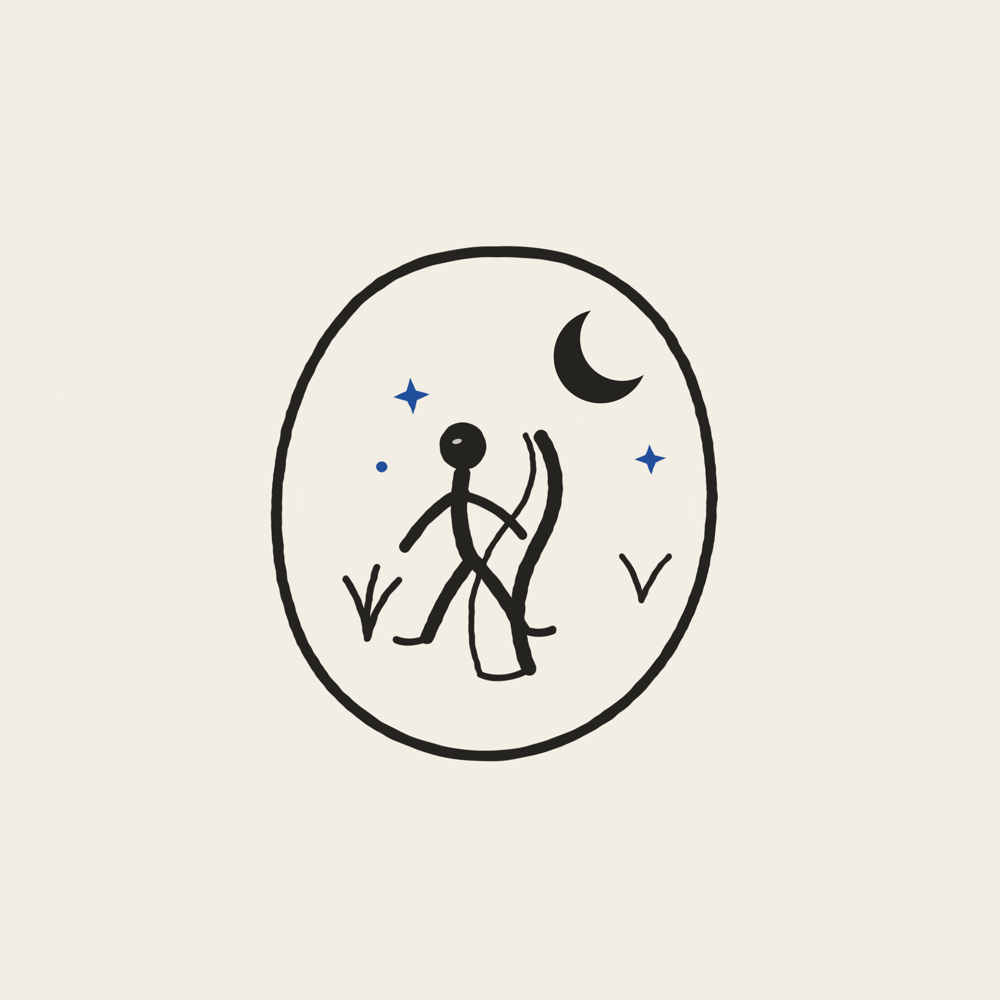
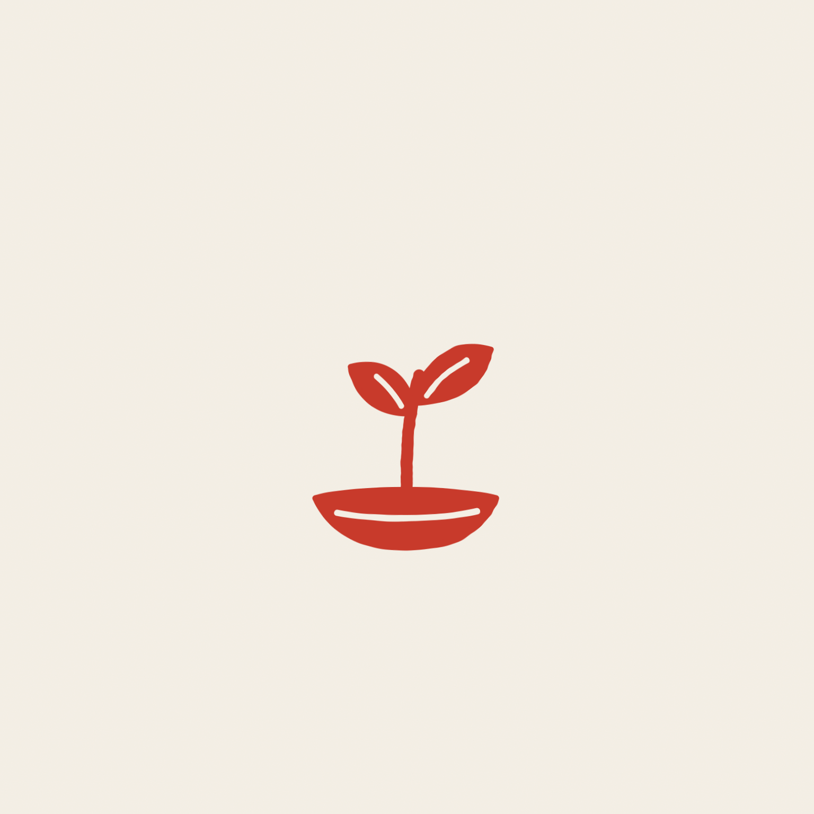
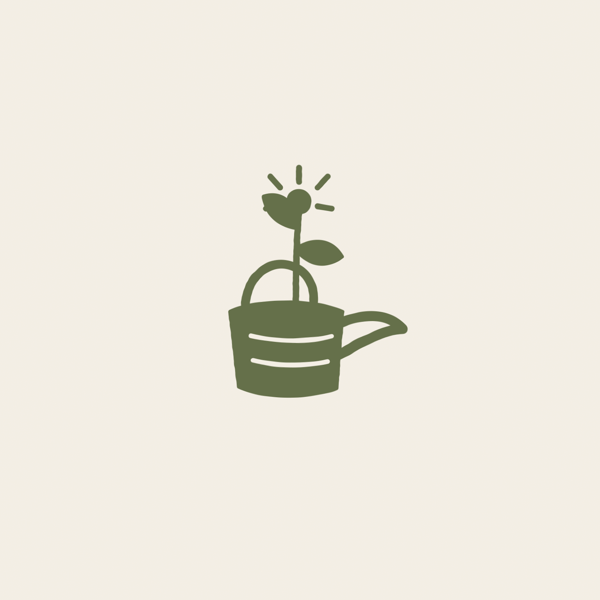
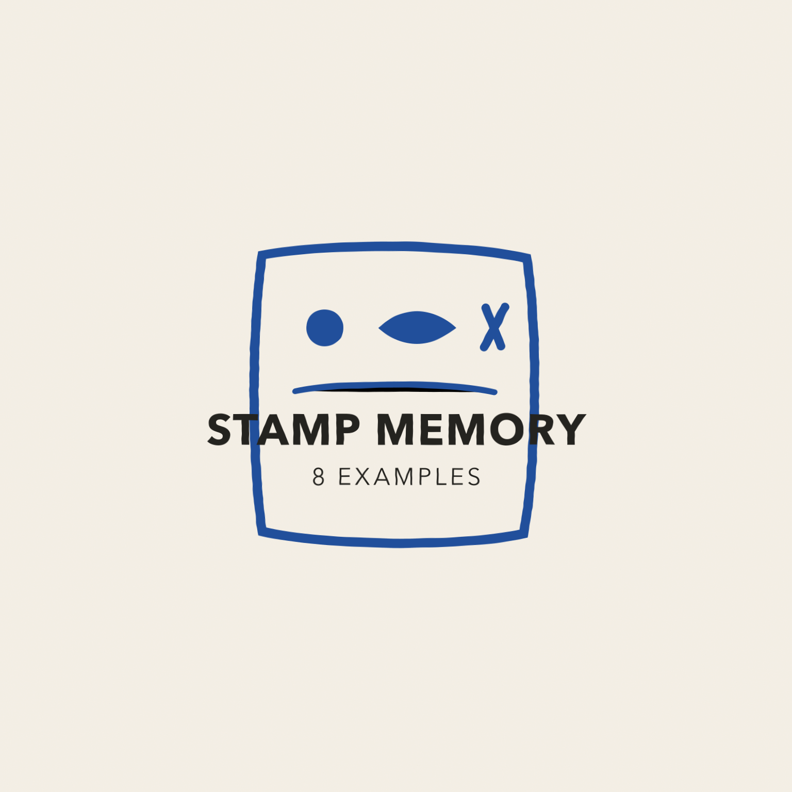
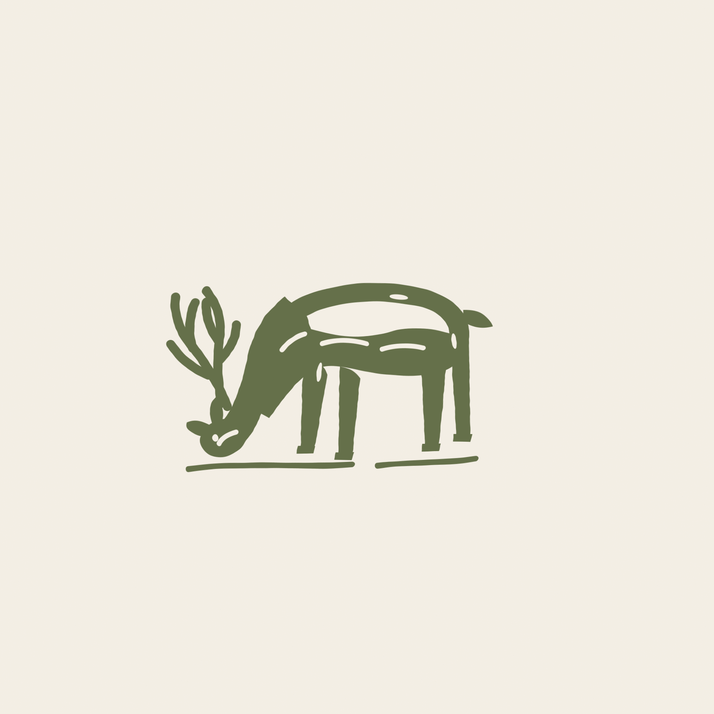
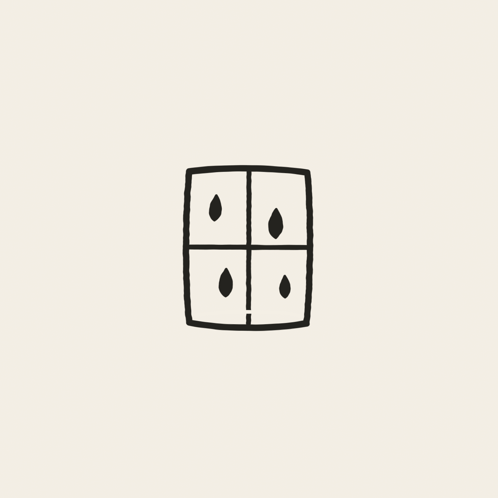
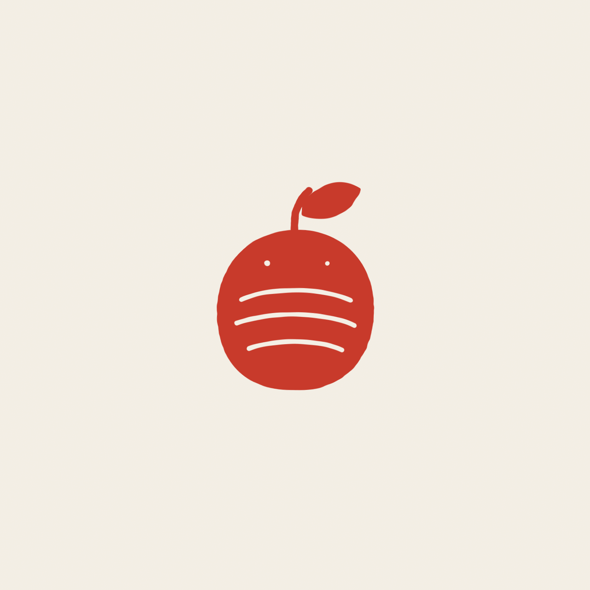
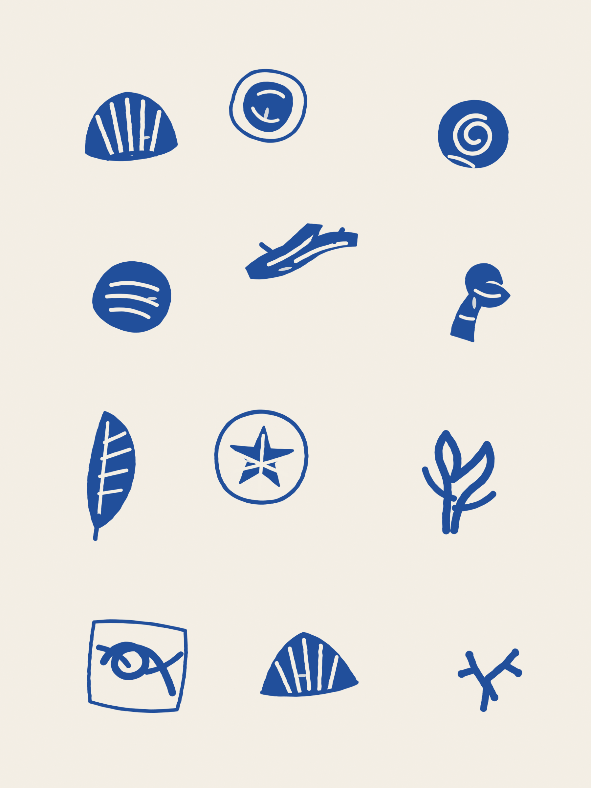

<div align="center">

[中文](./README.zh.md) · **English**

# Stamp Memory

---

**A quiet folk-print stamp skill for themes, memories, objects, and photographs.**

[](./SKILL.md)
[](./SKILL.md)
[](https://github.com/yanliudesign/stamp-memory/stargazers)

[](https://claude.ai/code)
[](./SKILL.md)

</div>

Turn a sentence, object, memory, or supplied photograph into an original small printed emblem. The skill keeps one recognizable subject, reduces it into carveable line and mass, and places it on warm paper with generous silence.

It preserves a visual system rather than copying a reference: restrained charcoal, cobalt, vermilion, and moss inks; hand-cut edges; compact human typography; and an intimate keepsake tone.

## Examples

<table>
  <tr>
    <td align="center" width="33%"><a href="./summer-night-walk.png"></a><br><sub>Summer-night walk</sub></td>
    <td align="center" width="33%"><a href="./read-slowly-bookplate.png"></a><br><sub>Read slowly</sub></td>
    <td align="center" width="33%"><a href="./starting-again-sprout.png"></a><br><sub>Starting again</sub></td>
  </tr>
  <tr>
    <td align="center" width="33%"><a href="./grandmothers-garden.png"></a><br><sub>Grandmother's garden</sub></td>
    <td align="center" width="33%"></td>
    <td align="center" width="33%"><a href="./grazing-deer-memory.png"></a><br><sub>Photo to stamp</sub></td>
  </tr>
  <tr>
    <td align="center" width="33%"><a href="./rainy-window.png"></a><br><sub>Rainy window</sub></td>
    <td align="center" width="33%"><a href="./pocket-orange.png"></a><br><sub>Pocket orange</sub></td>
    <td align="center" width="33%"><a href="./seaside-found-objects-sheet.png"></a><br><sub>Seaside finds</sub></td>
  </tr>
</table>

## What it does

| System | Direction |
|---|---|
| **Input** | A theme, phrase, object, memory, or supplied photograph |
| **Subject** | One recognizable emblem with at most two supporting marks |
| **Palette** | Warm paper + one dominant ink + one optional accent under 8% |
| **Space** | 65%–85% of the canvas remains unprinted paper |
| **Drawing** | Naive carved contours, solid masses, open negative shapes, controlled ink skips |
| **Type** | Optional compact hand-cut lettering; exact user wording only |
| **Output** | Raster image, exact generation prompt, and a short visual recipe |

## How it works

```text
1  Read the subject     →  find one meaning and one signature detail
2  Choose the form      →  borderless, oval, soft rectangle, or irregular tablet
3  Reduce for carving   →  merge shadows, open gaps, remove fragile detail
4  Apply the visual DNA →  warm paper, restrained ink, large negative space
5  Generate and inspect →  check identity, thumbnail clarity, and originality
```

### Language-to-stamp

Describe any theme in ordinary language. Abstract ideas are reduced to one concrete metaphor instead of becoming a crowded illustrated scene.

```text
Create a vermilion folk-print stamp about starting again. No text.
```

### Photo-to-stamp

Upload a portrait, pet, plant, place, or object. The skill preserves the identifying features, pose, and structure while rebuilding the image as printable line, mass, and negative space. It does not apply a threshold filter or imitate the source composition.

```text
Turn this photo of me and my cat into a quiet cobalt bookplate stamp.
```

## Visual rules

1. **Paper leads.** Warm ivory, chalk white, or pale oat remains the dominant field.
2. **One ink leads.** Charcoal, cobalt, vermilion, or moss carries the image; a second ink stays below 8% of printed marks.
3. **Silence is structural.** A single stamp occupies only 18%–34% of the canvas by default.
4. **Carving beats detail.** Shapes must survive at a physical stamp size of roughly 25–45 mm.
5. **Identity stays intact.** Supplied portraits, pets, and objects keep their defining features.
6. **Text stays subordinate.** No invented brands, dates, institutions, signatures, or decorative pseudo-writing.
7. **References are grammar, not templates.** Every result changes at least five structural variables from any supplied style reference.

## Not this

- not a corporate logo, app icon, badge, or sticker sheet
- not a glossy wax seal, embossed mockup, or product photograph
- not polished vector geometry or a one-click auto-trace
- not fake historical calligraphy, heraldry, or institutional identity
- not a reconstruction of any reference artwork

## Install

Clone the repository into your Claude Code skills directory:

```bash
git clone https://github.com/yanliudesign/stamp-memory.git \
  ~/.claude/skills/stamp-memory
```

Restart Claude Code after installation. Other agent environments can use the repository by loading [`SKILL.md`](./SKILL.md) as their skill entry point.

## Try it

```text
Create a stamp about a summer-night walk.
```

```text
Make a small moss-green stamp for the memory of my grandmother's garden.
```

```text
Create an ex libris stamp that says “READ SLOWLY,” with a small open book.
```

```text
Turn this flower photo into a vermilion hand-carved stamp. No text.
```

```text
Create a sheet of 12 unequal stamps about objects found on a coastal walk.
```

## Delivery format

One run returns:

1. a generated raster image;
2. the exact production-ready prompt used for generation;
3. a recipe naming the ink, shape, carving treatment, type treatment, and originality changes.

If the active environment has no image-generation capability, the skill returns the production-ready prompt and states that limitation instead of pretending an image was generated.

## Repository layout

```text
stamp-memory/
├── SKILL.md                 # Trigger rules, workflow, visual DNA, and QA gate
├── README.md                # English documentation
├── README.zh.md             # 中文说明
├── examples-index.png       # Center tile for the 3×3 example gallery
└── *.png / *.svg            # Eight raster examples and editable masters
```

## Originality

This skill extracts system-level qualities such as palette, materiality, density, line behavior, and emotional temperature. It does not copy a reference stamp's subject treatment, border, internal cuts, wording, lettering, or arrangement.

When a user supplies their own photograph, identity is preserved as content while the crop, abstraction, border, carving rhythm, and text placement are newly constructed.

---

Created by [Dreameryanyan](https://www.linkedin.com/in/yanliudesign/) · [LinkedIn](https://www.linkedin.com/in/yanliudesign/) · [X](https://x.com/yanliudreamer)